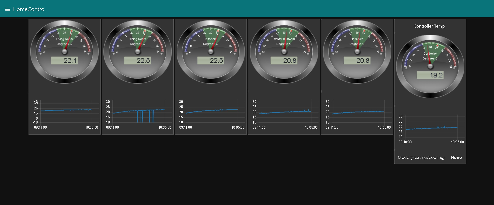
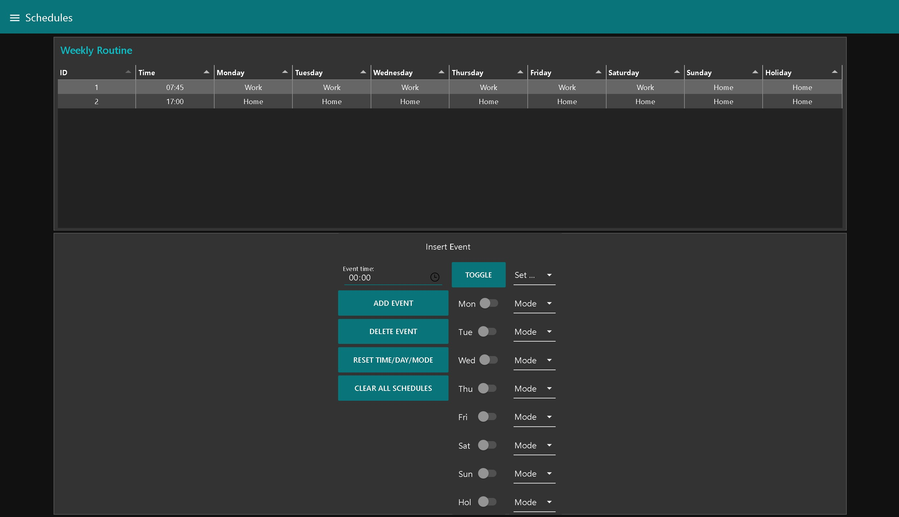
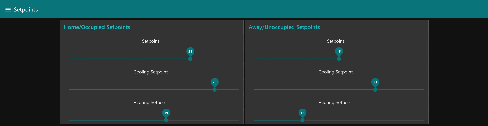

# NodeRed
Node Red Raspberry Pi based system for managing Thermostats

This repository contains all my work on Node Red for User Friendly touch based GUI's of Automation systems. The files are a compilation of all tests, tutorials and versions of the Node-red 'flows' that I have created.The system runs on a raspberry Pi and communicates over RS485 to thermostats in Modbus protocol. Bacnet protocol and support for more devices are on the roadmap. 

The tutorials and details about most of the Node-red flows can be found [here](https://forums.temcocontrols.com/c/Reference-and-help-for-Node-Red-efforts).  Please post a message at the forum if you have any questions or need help with any of the flows.

